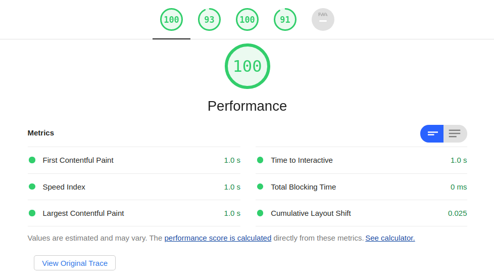
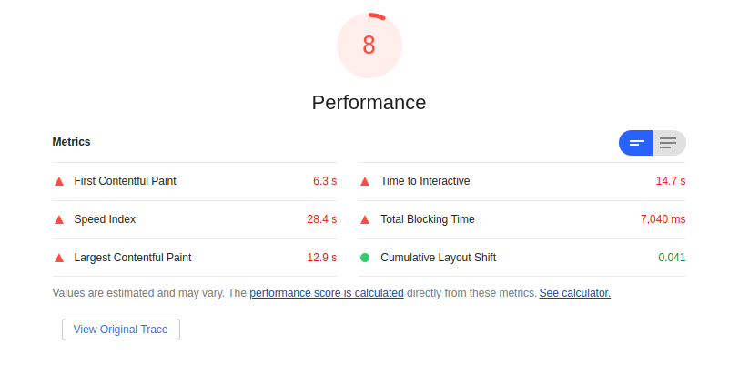

# Creating non-blocking, size-optimized layouts with Web Widgets

*Note: In this article, "ES" refers to ECMAScript, also known as "JavaScript."*

### Demo 

Production (frozen): https://web-widgets.netlify.app/widget.freeze

Development (CSR): https://web-widgets.netlify.app/widget.render.dev

**Frozen layout is 100% non-blocking and weighs only 7kB:**



### Loading a webpage

When loading a webpage, the source code of the layout is retrieved from a server and parsed by the browser. It contains:

- **structural** information via HTML markup (what's *on* the page)
- **stylistic** information via CSS styles (what things *look* like)
- **computational** information via ES logic (what things *do*)

The average webpage loads external resources like CSS stylesheets, ES scripts, fonts, etc. over the network, often over several different requests. It must also parse and execute those resources, including any ES scripts that are included in the page.

In general, most web pages are not optimized for performance. This has many many consequences for the user experience, including:

- **longer** loading times due to larger web pages
- **slower** execution of necessary ES scripts, since much of the time is spent executing dead code
- **blocking** of the initial page render as various scripts and styles are executed in order to paint the first frame

*Below: Lighthouse results for [Little Caesar's production Gatsby app](https://littlecaesars.com/), which ships server-side rendered¹ React.*



### What are Web Widgets?

Web Widgets is a proof-of-concept that aims to improve on these pain points. Web Widgets:

- are **written** as ES6 classes, and define *what* should be built by storing metadata and handling state
- are **rendered** to a live DOM for development
- are **frozen** to flat, backwards-compatible HTML markup for production (see the ***What is a frozen layout?*** section below)
- are **static** – everything can be compiled ahead-of-time, gzipped with max compression, and served from a CDN

### What is a frozen layout?

Frozen layouts are stateful layouts which will hydrate themselves and kick off their own state logic when sent to a browser, and:

- are **optimized** for size and dead code elimination
  - only the styles used in the layout will be included
  - if the widget is stateful, the state logic will be embedded (and Closure Compiled in production²)
  - all CSS/ES6 class, variable, etc. names are minified and mangled
  - all non-essential data is eliminated

- are **ready to paint** – that is, they do not block the initial page render (0ms blocking time), and the browser does not need to do any unnecessary computation to draw the first paint
  - `AsyncStylesheet` widgets are used to embed fonts in a [non-render blocking manner](https://web.dev/defer-non-critical-css/#optimize)
  - all embedded CSS styles and compiled ES state logic are async

In short, this proof-of-concept demonstrates that we can encode layouts as pure ES via UI-as-code, and develop an algorithm (mostly with with existing technology) whereby the rendered layout can be *frozen* to a size-optimized state, largely relying on Closure Compiler to optimize and compress all CSS class names and internal component state logic.

For the Demo, which consists of a button and a counter which increments when it is tapped (plus some headers and a nontrivial `ScrollIndicator`), the frozen output document weighs about 7kB gzipped.

### Syntax

Widget classes specify a *type* of UI component, and they have the following top-level properties:

- `tag`, a `string` that will override the DOM node's `tagName`, useful for inheriting native browser functionality
- `styles`, an `array<string>` that specifies the CSS styles associated with this type of widget; and
- `attributes`, an `object<string, string>` key-value map of attributes

Widgets also:

- inherit their constructor's static `tag`, `styles`, and `attributes` fields as instance properties
- inherit their class name as their tag name in dev mode (i.e. `class CustomWidget extends Widget {…}` would default to a tag like `<customwidget attr="val">`)
- inherit `w` as their tag name in production mode (unless overridden, i.e. `class Link { static tag = 'a'; }` would correctly build an `<a>` element) for max redundancy elimination; and
- use `setState() {...}` to modify widget state, inspired by Flutter.

For example, see the following `CounterView`, a `StatefulWidget` which builds a `SpaceEvenly` widget with some children:

```javascript
/**
 * A layout containing a number that increments when a button is pressed.
 */
export class CounterView extends StatefulWidget {
  /** Initializes state when constructor is called. */
  initState() {
    this.state.count = 0;
  }
  /** Builds the widget to render. */
  build() {
    return new SpaceEvenly(
        new ExtraLargeText(this.state.count),
        new SimpleButton('PRESS ME').on(
            'click',
            this.setState(() => this.state.count++),
        ),
    );
  }
}
```

### Building and compiling

`new CounterView().render()` builds a DOM node like:

```html
<spaceevenly class="SpaceEvenly Expanded Flex Widget">
    <extralargetext class="ExtraLargeText Widget" style="user-select: none">0</extralargetext>
    <button class="SimpleButton Button Widget">PRESS ME</button>
</spaceevenly>
```

We can embed the state logic and freeze to an HTML string with `new CounterView().freeze()`:

```html
<spaceevenly class="SpaceEvenly Expanded Flex Widget">
    <extralargetext class="ExtraLargeText Widget" style="user-select: none">0</extralargetext>
    <button class="SimpleButton Button Widget">PRESS ME</button>
    <script async="true">(function(){var el=document.currentScript.parentNode;requestAnimationFrame(function(){CounterView.from(el).render();});})();</script>
</spaceevenly>
```

For a production freeze, this compiles to:

```html
<w class="T F D w"><w class="Y w" style="user-select:none">0</w><button class="xa S w">PRESS ME</button><script async="true">(function(){var el=document.currentScript.parentNode;requestAnimationFrame(function(){Z.a(el).h();});})();</script></w></w>
```

Where the tag name, CSS classes, and state logic (if any) have been minified and embedded by Closure Compiler³.

---

### Footnotes

¹ Because React's "server-side rendered" output often blocks the render for an extended period of time building out the render tree (and are thus not **ready to paint**), they are not *really* rendered on the server, and thus the term is a misnomer.

² Production freeze output is compiled with Google's Closure Compiler, which handles name-mangling, dead code elimination, and other optimizations to produce the fastest, smallest ES5 output possible.

³ Closure Compiler performs all the name-mangling in the production freeze process, including for CSS classes. Because the CSS class names are generated from the ES6 class names, and they are referenced in this way when the widget renders itself, this occurs naturally, without extra configuration.

In the embedded state logic, a top-level function called `Z` is called – `Z.a(el).h()` is the compiled version of `CounterView.from(el).render()`. The compiled  styles and function definitions for `Z` (and all other widgets in the layout) are embedded in the  `<head>` element.

